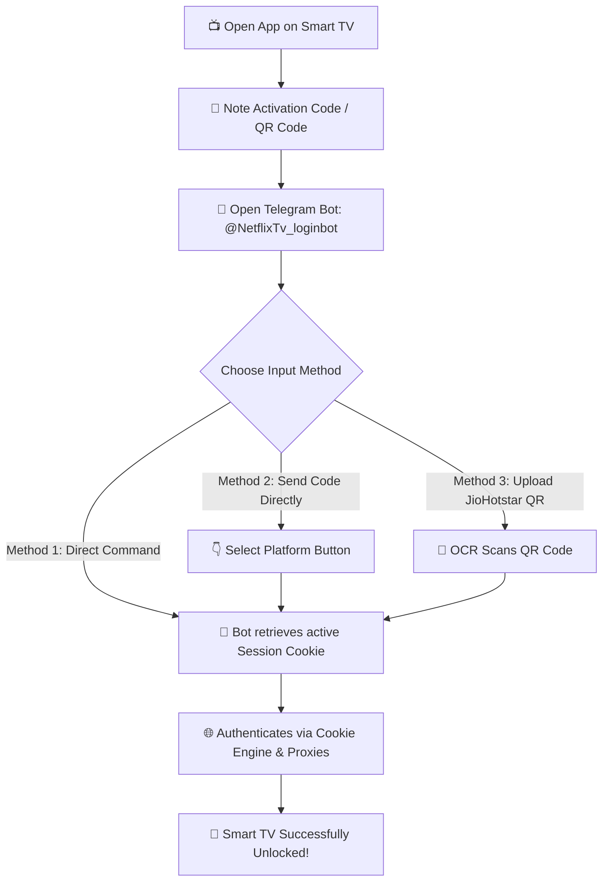

# 🎬 XDROID TV ACTIVATION BOT ⚡

> **The Ultimate Multi-Service Smart TV Activation Bot**  
> *Easily activate streaming apps and VPNs on your Smart TV in seconds.*

---

## 🔗 Official Bot Link
👉 **Launch Bot:** [https://t.me/NetflixTv_loginbot](https://t.me/NetflixTv_loginbot)  
👉 **Support Contact:** [@Sudhirxd](https://t.me/Sudhirxd)

---

## 📌 Overview & Supported Services

**XDROID TV Activation Bot** allows you to seamlessly activate popular streaming services and VPN applications directly on your Smart TV screen without manually typing passwords or credentials.

### 🌟 Supported Platforms
* 🔴 **Netflix**: Fast 8-digit TV code activation.
* 🟠 **Crunchyroll**: 6-character TV device code authorization.
* 🟣 **HBO Max (Max)**: 6-character TV activation.
* 🔵 **Surfshark VPN**: 6-character TV pairing code.
* 🟢 **Spotify Premium**: 6-character TV connect code.
* 🔵 **JioHotstar**: **Automated QR Code Screenshot Scanner**.

---

## 🛡️ Smart Cookie Engine & Technology

The bot operates on an advanced automated session infrastructure designed for maximum speed and reliability:

* 🍪 **Automated Cookie Vault & Rotation**: Powered by pre-authenticated premium session cookies, automatically linking your TV code to active streams without requiring manual logins.
* ⚡ **Instant Session Pairing**: System automatically picks and verifies working cookies to pair your Smart TV screen instantly.
* 🌐 **Smart Proxy Bypassing**: Built-in proxy rotation system to bypass regional lockouts and IP rate limits for flawless authentication.
* 🔒 **Zero Credentials Required**: 100% secure—you never need to share personal passwords or sensitive data. Simply enter the code displayed on your TV screen!

---

## ⚡ How It Works (Workflow)

---

## 📖 User Guide — How to Activate Your TV

### 🔹 Method 1: Using Quick Commands (Recommended)

1. Open your desired app on your Smart TV (Netflix, Crunchyroll, HBO Max, Surfshark, Spotify, or JioHotstar).
2. Note down the **Activation Code** displayed on your TV screen.
3. Open [@NetflixTv_loginbot](https://t.me/NetflixTv_loginbot) on Telegram and enter the command corresponding to your platform:

| Service | Command Syntax | Code Format | Example |
| :--- | :--- | :--- | :--- |
| 🔴 **Netflix** | `/netflix <code>` | 8 Digits | `/netflix 12345678` |
| 🟠 **Crunchyroll** | `/crunchy <code>` | 6 Characters | `/crunchy ABC123` |
| 🟣 **HBO Max** | `/hbomax <code>` | 6 Characters | `/hbomax XYZ789` |
| 🔵 **Surfshark** | `/surfshark <code>` | 6 Characters | `/surfshark UVW456` |
| 🟢 **Spotify** | `/spotify <code>` | 6 Characters | `/spotify MNO123` |
| 🔵 **JioHotstar** | `/jiohotstar <code>` | 6 Characters | `/jiohotstar JKL890` |

---

### 🔹 Method 2: Direct Code Typing (Interactive Menu)

1. Simply type and send your TV code directly in the private chat with [@NetflixTv_loginbot](https://t.me/NetflixTv_loginbot) (e.g. `ABC123` or `12345678`).
2. An **Interactive Selection Menu** will appear with service buttons.
3. Click the button matching your target platform (Netflix, Crunchyroll, HBO Max, Surfshark, Spotify, or JioHotstar).
4. The bot will automatically apply an active cookie and activate your Smart TV screen! 🚀

---

### 🔹 Method 3: JioHotstar QR Code Scanner

1. Take a clear photo/screenshot of the **QR Code** shown on your JioHotstar TV app screen.
2. Send the photo to the bot by using `/jiohotstar` or clicking **JioHotstar** in the menu and replying with the image.
3. The built-in scanner will automatically process the QR code and authorize your TV session! 📸⚡

---

## 💡 Essential Bot Commands

* `/start` — Open the main interactive menu & view vault session stats.
* `/help` — View activation instructions & support details.
* `/tv` — Open service selection menu to activate any TV code.
* `/netflix <code>` — Activate Netflix.
* `/crunchy <code>` — Activate Crunchyroll.
* `/hbomax <code>` — Activate HBO Max.
* `/surfshark <code>` — Activate Surfshark VPN.
* `/spotify <code>` — Activate Spotify.
* `/jiohotstar <code>` — Activate JioHotstar (Code or QR screenshot reply).

---

## 📞 Need Help?

If you encounter any issues or have questions regarding activation:
* **Telegram Bot**: [https://t.me/NetflixTv_loginbot](https://t.me/NetflixTv_loginbot)
* **Support**: [@Sudhirxd](https://t.me/Sudhirxd)
